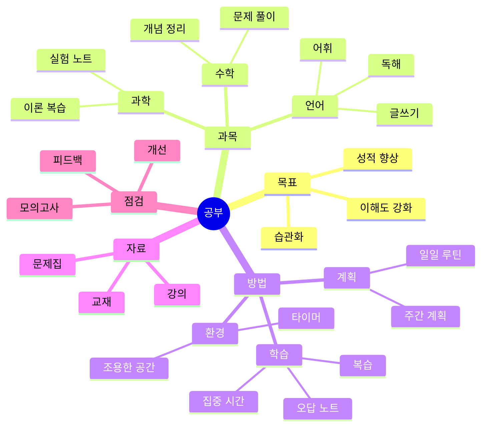

# 공부 마인드맵

```mermaid
mindmap
  root((공부))
    목표
      성적 향상
      이해도 강화
      습관화
    과목
      수학
        개념 정리
        문제 풀이
      과학
        이론 복습
        실험 노트
      언어
        어휘
        독해
        글쓰기
    방법
      계획
        주간 계획
        일일 루틴
      학습
        집중 시간
        복습
        오답 노트
      환경
        조용한 공간
        타이머
    자료
      교재
      강의
      문제집
    점검
      모의고사
      피드백
      개선
```
